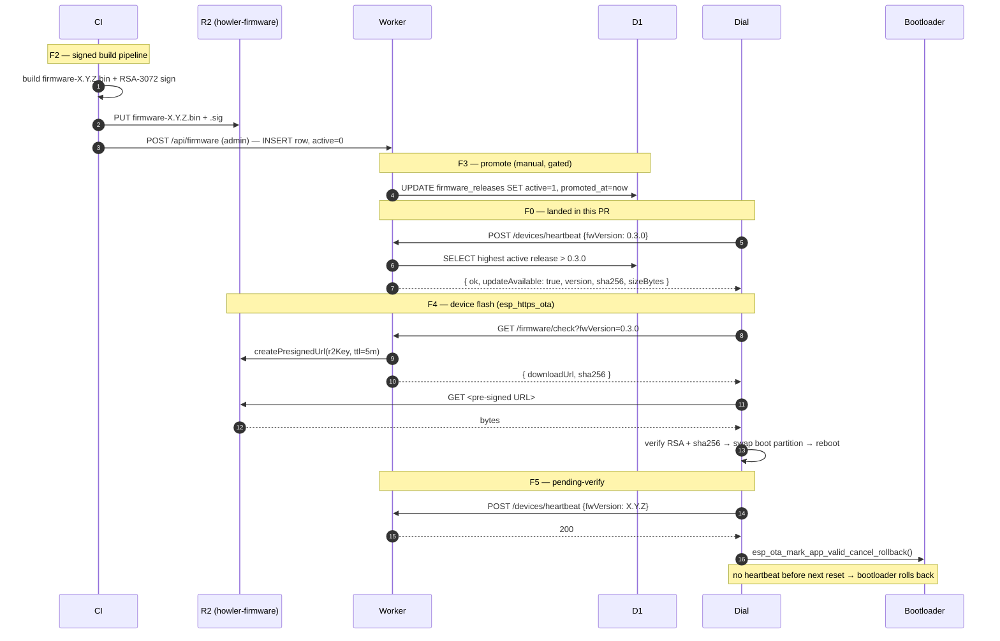

# OTA — design + work checklist

Phase 6 per [`plan.md §14`](plan.md#14-ota-updates). End state: signed
firmware images on R2, dual-app OTA partition layout on the dial,
`esp_https_ota` self-update with pending-verify + auto-rollback,
manifests served by the Worker.

This doc tracks both the **target design** and the **slice-by-slice
implementation plan**. The `dev-31-result-picker` PR lays the
backend read path; everything below it is still to do.

---

## Status — slices F0 + F1 (foundation + admin write path)

| | |
| --- | --- |
| Migration `0013_firmware_releases.sql` | ✅ F0 |
| Drizzle schema (`firmwareReleases`) | ✅ F0 |
| `GET /api/firmware/check?fwVersion=X` | ✅ F0 |
| `POST /api/devices/heartbeat {fwVersion}` | ✅ F0 |
| Semver-aware version compare | ✅ F0 |
| Rollout rules (`deviceIds` + `canaryPercent`) | ✅ F0 |
| `requireAdmin()` middleware + `ADMIN_HOMES` env | ✅ F1 |
| `POST /api/firmware` (admin upload-manifest) | ✅ F1 — zod-validated, version regex, idempotent on duplicate (409), lands `active=0` |
| `PATCH /api/firmware/:version` | ✅ F1 — promote (sets `promoted_at`), yank (sets `yanked_at`), update `rolloutRules` |
| `GET /api/firmware` (admin listing) | ✅ F1 |
| Integration tests | ✅ — 14 cases ("OTA — firmware release advisory" + "OTA — admin write path") |

The shape is intentionally additive — old clients ignore the new
endpoints; `firmware_releases` is empty until something INSERTs a
release row, so deploying these slices has zero behavioural change
for production until a build is uploaded + promoted.

**Operational gate.** The admin allow-list is the comma-separated
`ADMIN_HOMES` env var. Empty string = nobody is admin (the safe
default). Set in production via `wrangler secret put ADMIN_HOMES`
with the home id of whoever runs the OTA console — there's no
first-class admin role yet, so this is the F1 placeholder per the
"slice gates" pattern from earlier in this doc.

---

## Sequence diagram (target end-state)

Mirrors `plan.md §14`'s mermaid diagram; pinned here so the next
slices can refer to it without sprawling the plan doc.



---

## Remaining work — slice F1…F5

Each slice is a separate PR. They can land in order; later slices
gate on earlier ones being live in production.

### F1 — admin POST `/api/firmware` ✅ (landed in dev-33-ota-f1-admin)

Implemented per the original plan; see the status table above.
Three handlers under one router:

- `POST /api/firmware` — zod-validated body, version regex
  rejects `"1.4.0; DROP TABLE …"`, idempotent on duplicate
  version (409), lands `active=0`.
- `PATCH /api/firmware/:version` — promote (sets `promoted_at`
  on first promotion, preserves it across re-promotes), yank
  (sets `yanked_at`), or update `rolloutRules` in place.
- `GET /api/firmware` — admin-only listing for the ops UI.

`requireAdmin()` consults `ADMIN_HOMES` (comma-separated home
IDs, env var). Empty list = nobody is admin (fail-closed).

### F2 — CI signed-build pipeline (medium, ~3 days)

- New GitHub Actions job that runs on `release/*` branches:
  1. `pio run -e crowpanel` produces `firmware-merged.bin`.
  2. RSA-3072 sign step using a private key from CI secrets
     (`OTA_SIGNING_KEY`). Public key checked into firmware as a
     C array via `scripts/embed_pubkey.py`.
  3. `wrangler r2 object put howler-firmware/firmware-X.Y.Z.bin`.
  4. `curl POST /api/firmware` to register the manifest.
- Public-key generation: `openssl genpkey -algorithm RSA -pkeyopt
  rsa_keygen_bits:3072 -out signing.pem`. Store private in CI;
  commit public to firmware repo.

### F3 — Pre-signed URL minting (small-medium, ~1 day)

- Wire `aws-sdk-js-v3 @aws-sdk/s3-request-presigner` (or the
  Cloudflare equivalent) into `/api/firmware/check`. Replace the
  current `r2Key` field on the response with `downloadUrl` (a 5-min
  TTL signed GET URL).
- Add `accessKeyId` + `secretAccessKey` Cloudflare R2 secrets to
  the Worker. **Don't** check creds into the repo.
- Test: response carries a `downloadUrl` matching
  `https://<account>.r2.cloudflarestorage.com/howler-firmware/...`
  with `X-Amz-Signature=...`.

### F4 — Firmware self-update (large, ~1 week, hardware required)

- New PlatformIO env or build flag for `esp_https_ota`-based update
  flow. ESP-IDF component already vendored as part of Arduino-ESP32.
- Partition table: `factory + ota_0 + ota_1 + otadata` (8 MB flash
  has room — current `partitions/default_16MB.csv` already specs
  this; no migration needed).
- New `IOtaPort` / `EspOtaAdapter` pair in
  `firmware/src/{application,adapters}/`. Exposed methods:
  - `checkForUpdate(currentVersion) → optional<UpdateAdvisory>`
  - `downloadAndFlash(advisory) → bool` (verifies signature + sha256
    before swapping boot partition).
- Driven from the heartbeat callback when `updateAvailable: true`
  lands. Settings → "Check for updates" tile triggers the same path
  on demand.
- Hardware-only test: HIL-3 on a real CrowPanel — flash a v0.3.x,
  promote v0.3.x+1, observe the swap + first-boot heartbeat.

### F5 — Pending-verify + auto-rollback (small once F4 lands)

- After flash, mark new image `pending_verify`
  (`esp_ota_mark_app_valid_cancel_rollback` deferred).
- On first successful sync round (or heartbeat 200 — whichever the
  device sees first), call `cancel_rollback`.
- If the dial reboots before that lands, the bootloader auto-falls-
  back to the previous slot.
- Server-side observability: log heartbeat events with their
  `fwVersion` and dashboard the per-version success rate. If a
  release shows <90 % success across the first 100 devices, an
  on-call human flips `active = 0` (the F1 endpoint already
  supports this).

---

## Things explicitly NOT in scope

- **Mandatory updates / forced reboots** — every install path
  here is opportunistic. The dial picks up the new build on next
  natural boot or via Settings → "Check for updates"; we never
  reboot the user out from under their workflow.
- **Delta updates** — full image only. Howler firmware is
  ≤ 2 MB; the bandwidth saving doesn't justify the binary-diff
  toolchain complexity. Revisit if the image grows past ~8 MB.
- **A/B blue-green at the dial** — the dual-partition layout IS A/B,
  but there's no "live both copies in parallel" idea. Slot 0 is
  active, slot 1 is staging until promoted by reboot.

---

## Operational notes (post-F2)

**Releasing.** `git tag v1.4.2 && git push --tags` triggers the F2
job. The release lands `active = 0`. Promote via:

```bash
curl -X PATCH https://howler-api.atsyg-feedme.workers.dev/api/firmware/1.4.2 \
  -H "Authorization: Bearer <admin-user-token>" \
  -H "Content-Type: application/json" \
  -d '{"active": true, "rolloutRules": {"canaryPercent": 5}}'
```

5 % canary → watch heartbeat success → promote to 100 % by
PATCHing `rolloutRules: null`. **Yank** by PATCHing `active: false`
(the `yanked_at` column gives a clean audit trail).

**Rollback.** If a yanked build is already on a device, that
device keeps it (the bootloader has no concept of "the server
yanked this version"). To force a downgrade, ship a new build with
a higher version number that contains the old code. Don't try to
rewind versions in `firmware_releases` — version is the primary key.
