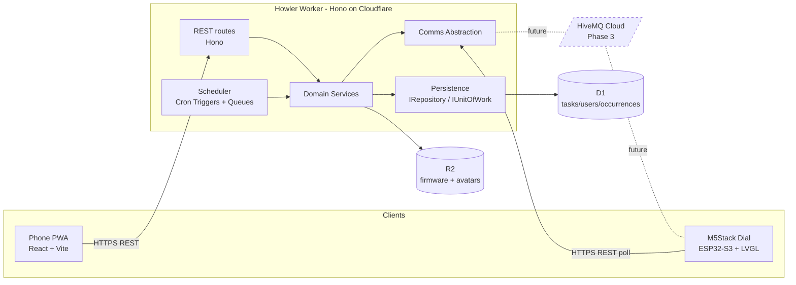
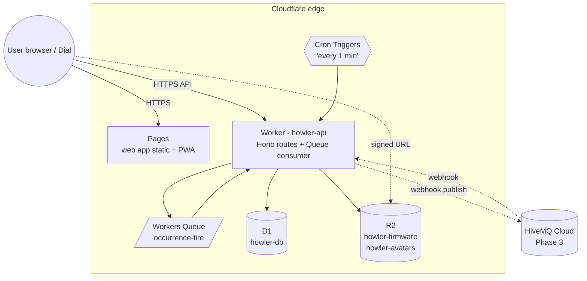
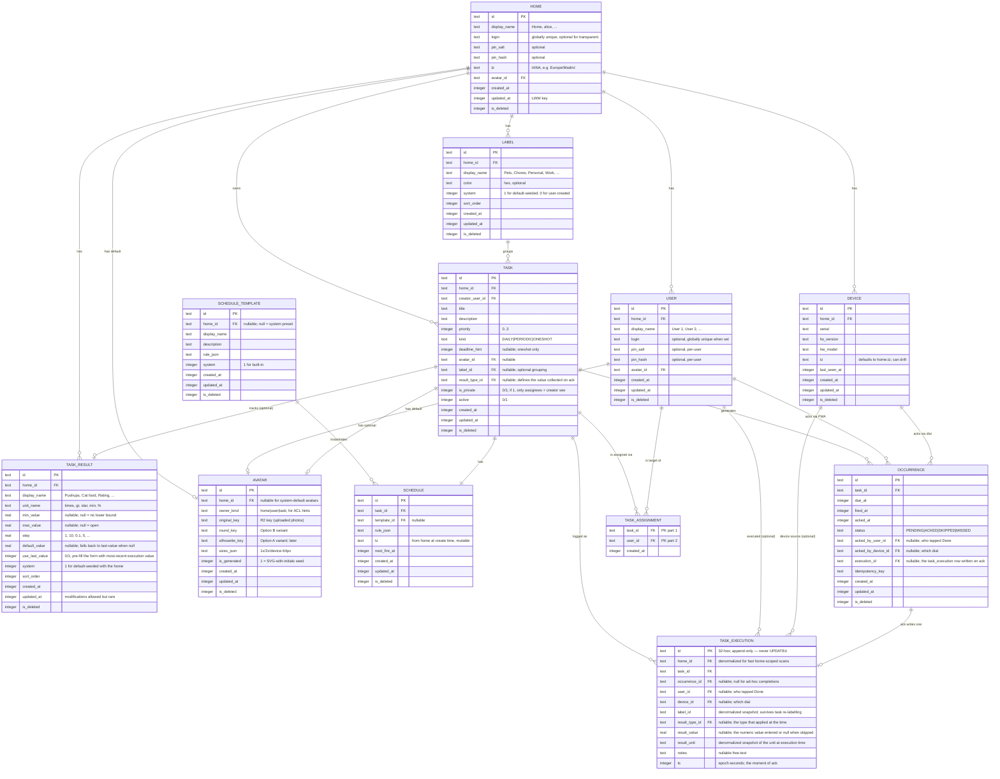
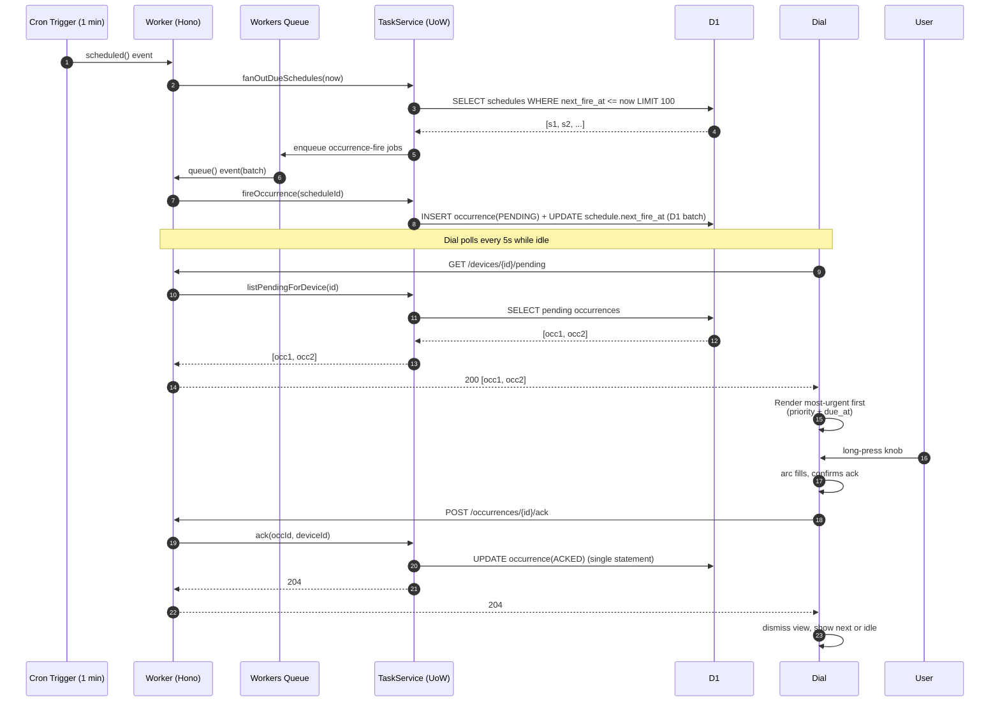
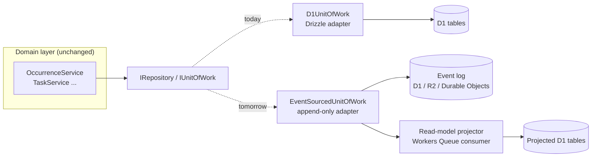
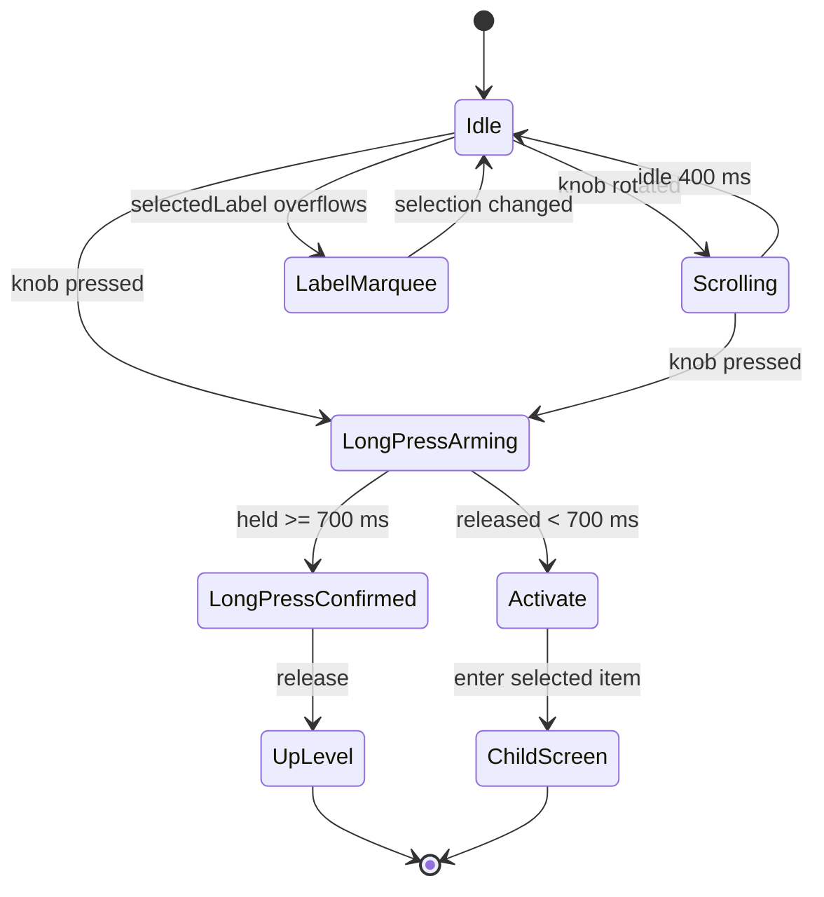
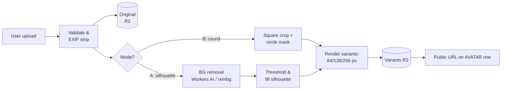
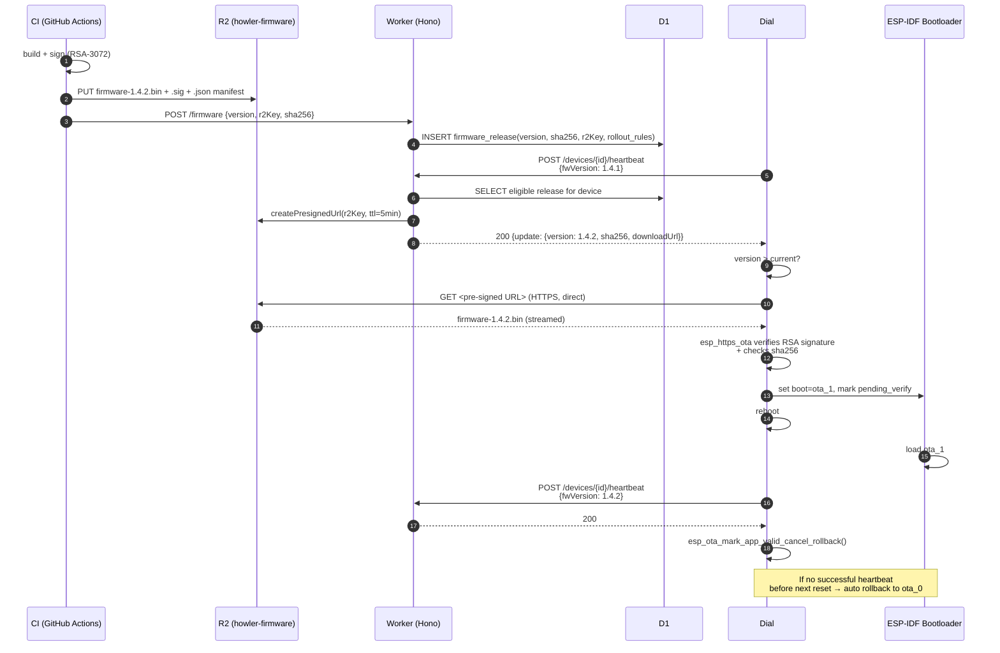

# Howler — Plan

> A general-purpose task tracker for regular, periodic, and one-time tasks.
> Successor to **Feedme** (single-purpose cat feeder controller).

---

## 1. Executive Summary

**Howler** generalizes the Feedme cat-feeder controller into a generic, household-grade **task tracker** addressable from a phone (PWA) and a small physical desk device (M5Stack Dial). It models three task shapes — scheduled-with-time, periodic-without-time, and one-shot-with-vague-deadline — and surfaces them via a unified menu UX on the device and a responsive web app. The whole stack runs on **Cloudflare** from day one: **Pages** for the web app, **Workers + Hono** for the API, **D1** for relational data, **R2** for binaries, **Cron Triggers + Queues** for scheduling.

**Differences from Feedme:**

| Axis | Feedme | Howler |
| --- | --- | --- |
| Domain | Cat feeding only | Generic recurring + one-off tasks |
| Task shapes | Time-of-day only | Time-of-day, periodic, one-shot |
| Server routing | Raw `export default { fetch }` with 700-line pathname chain | **Hono** router with per-resource sub-routers |
| Hosting | Cloudflare Pages + Workers + D1 (proven) | **Same — inherited unchanged** |
| Persistence | Raw `env.DB.prepare(SQL).bind()` inline in handlers | **Drizzle + Repository + Unit of Work** (event-sourcing-ready) |
| Migrations | 11 hand-rolled SQL files + 22 npm scripts + parallel `schema.sql` | **drizzle-kit** + `wrangler d1 migrations apply` |
| Validation | Hand-rolled `isInt`/`isUuid` type guards | **Zod** end-to-end, shared with webapp |
| Comms | REST polling (`/api/sync` LWW), no MQTT | Abstracted (REST today, MQTT via HiveMQ later) |
| Device UI | Ad-hoc menus | Composite contract: control region + info view |
| Updates | Manual flash | Signed OTA with rollback |
| Avatars | n/a | Per-task urgency-tinted imagery |
| Testing | Ad-hoc | Layered + HIL strategy |

### 1.1. Priority — current focus *(updated 2026-05-06)*

**Server + webapp first; device firmware deferred until both are stable and functional.**

Concretely: §18's roadmap was reordered so Phases 1–3 are entirely
server + webapp work (auth, scheduler, web CRUD, observability,
Playwright happy-path), and device-firmware work begins in Phase 4
once the web stack is *demo-ready and bug-quiet*. The hardware
choice in §4, the firmware stack in §12, the device UX contract
in §11, the OTA design in §14, and the comms abstraction's MQTT
adapter in §10 are all still authoritative — they're just not
active development surfaces until Phase 4 starts.

**Why:** the device only earns its keep when the server + web app
underneath it are reliable. Delivering the phone-first experience
end-to-end first means we (a) catch protocol-level mistakes before
they're baked into firmware, (b) have something to demo the moment
hardware exists, and (c) avoid the failure mode where firmware bugs
mask server bugs (or vice versa) during integration.

**What this does NOT change:**
- The **comms abstraction** (§10) stays in place from day one — the
  REST polling adapter is what the webapp uses today; the device
  just hasn't grown one yet.
- The **Repository / UnitOfWork** seam (§9) is already the discipline
  the server uses; nothing about the deferral relaxes it.
- The **firmware skeleton** (`firmware/` with `domain/application/
  adapters` layout, native + simulator PlatformIO envs) remains in
  the repo and keeps building in CI — the build is the canary that
  catches breaking architectural changes early.

---

## 2. Glossary

- **Task** — a thing the user wants to remember to do.
- **Schedule** — the recurrence rule attached to a task (cron-like, interval, or none).
- **Occurrence / Execution** — a concrete fired instance of a task; can be `pending`, `acked`, `skipped`, `missed`.
- **Schedule Template** — pre-canned schedules (e.g. "3-meals/day", "weekly", "every-3-days") the user picks from.
- **Comms Layer** — the transport abstraction between device and server.
- **Control Region** — the standardized portion of a device screen that handles knob/menu input.
- **Info View** — the screen-specific portion that renders content (avatar, list, text).
- **Dial** — the M5Stack Dial device (ESP32-S3 + rotary knob + 1.28" round LCD).
- **UoW** — Unit of Work; an atomic span of repository operations against the DB.
- **Spec** — Specification object; a transport-free predicate passed to repositories.

---

## 3. Engineering Principles

These cross-cut every section below. We pick libraries to honour them, not the other way round.

**SOLID at module/class boundaries.**

- **SRP** — services are named after a single domain noun-verb (e.g. `OccurrenceFiringService`, not `TaskManager`).
- **OCP / LSP** — every external boundary (DB, transport, scheduler, storage, AI bg-removal, OTA) sits behind an interface; new adapters drop in without touching domain code.
- **ISP** — interfaces are narrow. `CommsLayer` doesn't know about firmware; `IRepository` doesn't know about HTTP.
- **DIP** — domain depends on `IRepository`, `CommsLayer`, `IFirmwareStore`, `IClock` — never on Drizzle, Hono, R2 SDK, or `Date.now()`.

**Clean Code.**

- Functions short and intention-revealing. If a comment explains *what* the code does, rename the function.
- Errors are values for expected failures (`Result<T, E>` from `neverthrow` or a hand-rolled equivalent), thrown for programmer bugs.
- No dead code, no commented-out blocks, no "we might need this later" exports.
- One assertion per test, one purpose per file.

**Concrete instance — comms.** §10 shows the comms abstraction. Domain code calls `CommsLayer.notifyDevice(...)`. The REST polling adapter today and the MQTT adapter tomorrow are interchangeable; neither is visible to a service. That single example is the model for every other boundary in §9 and §14.

---

## 4. Hardware — CrowPanel ESP32 Rotary Display 1.28" *(per Feedme)*

> **§1.1 status: device work is Phase 4+.** The pin map, partition
> layout, and driver decisions below remain authoritative — we just
> aren't soldering until the server + webapp are stable.

**Updated after Feedme review.** The board Feedme already runs on is the **CrowPanel 1.28" HMI ESP32 Rotary Display** (Elecrow):

- ESP32-S3, 16 MB flash, 8 MB OPI PSRAM (chip variant `ESP32-S3R8V`-style)
- 1.28" round IPS LCD, **240×240**, GC9A01 driver, BL on GPIO 46
- **Rotary encoder + push button** (matches the Howler spec)
- CST816D capacitive touch
- 5-LED WS2812 ring under the bezel (GPIO 2 enables power)
- USB-C
- GPIO 1 must be driven HIGH to power the LCD's 3.3 V rail (per `firmware/main.cpp` in Feedme)

**Confirm with user:** keep CrowPanel (matches spec, has working drivers in Feedme) or switch to M5Stack Dial. Recommendation: **keep CrowPanel** — Feedme proves it works and we inherit the partition table, pin map, and adapter implementations.

If switching, the M5Stack Dial (SKU K136, ESP32-S3FN8, 8 MB flash, no NeoPixel ring, Grove port) is the only realistic alternate with a rotary encoder.

---

## 5. Architecture Overview

### 5.1 Logical components



The **Comms Abstraction** is one seam; the **IRepository / IUnitOfWork** in §9 is another. Both are required to land Phase 1.

### 5.2 Cloudflare deployment topology



Notes:

- One Worker handles HTTP, scheduled (Cron), and queue (consumer) handlers — same code, three entry points.
- Pages serves the React build; CSP locks API origin to the Worker's domain.
- D1 + R2 are bound to the Worker via `wrangler.toml`; no network credentials in code.

---

## 6. Data Model

> **Reshaped 2026-05-06: home-centric model.** Howler now uses a
> household-style multi-tenant model: a **HOME** is the top-level
> container; users, devices, tasks, labels, and avatars all belong
> to a home. This restores Feedme's auth-realm shape while keeping
> Howler's per-user attribution. Phase 1's user-centric schema
> (deployed in migrations 0000 + 0001) gets rebuilt by migration
> 0002 — see §6.1.



### 6.1. Migration 0002 — home-centric rebuild

Migrations `0000_init.sql` + `0001_auth.sql` are deployed but carry
zero real data (Phase 0 + Phase 1 dev only). Migration `0002_home.sql`
rebuilds the affected tables in one shot rather than multi-step
expand-contract:

1. `CREATE TABLE homes` with full set of columns above.
2. Rebuild `users`: add `home_id`, drop `email`, keep `username` →
   rename to `login` (still globally unique when set, NULL for
   transparent users with no PIN).
3. `CREATE TABLE labels` and seed each newly-created home with
   four system labels: **Pets**, **Chores**, **Personal**, **Work**.
4. Rebuild `tasks`: drop `user_id`; add `home_id`, `creator_user_id`,
   `label_id`, `is_private`.
5. `CREATE TABLE task_assignments` (composite PK on `(task_id,
   user_id)`).
6. Rebuild `occurrences`: rename `acked_by_device` → `acked_by_device_id`;
   add `acked_by_user_id`.
7. Rebuild `devices`: drop `user_id`; add `home_id`, `tz`.
8. Rebuild `pending_pairings` to claim against `home_id` (still keyed
   by `device_id`).
9. Rebuild `login_qr_tokens`: payload binds `(home_id, device_id)`;
   exchange returns the home's user list and a *temporary* selector
   token — the phone POSTs `/api/auth/select-user` to pick which
   user the session is for (see §6.2).
10. `CREATE TABLE avatars` with default-generation flag; `home_id`
    is nullable for the small set of system fallback avatars.
11. Rebuild `schedule_templates`: add `home_id` (null = system preset)
    and `system` flag.
12. `CREATE TABLE task_results` (the type definitions) and seed each
    new home with the default set in §6.5.
13. `CREATE TABLE task_executions` — the append-only log. No UPDATE
    statements ever touch this table; corrections happen via a new
    "correction" row in a future phase if the need arises.
14. Add `tasks.result_type_id` (FK to `task_results.id`, nullable).
15. Add `occurrences.execution_id` (FK to `task_executions.id`,
    nullable) so the read-side can hop occurrence → execution
    without extra joins.

The rebuild is destructive but safe at this point — the prod database
has 0 home rows and no real users (a few smoke-test transparent users
that get nuked).

### 6.2. Auth model after the home pivot

| Token | Claims | Where it gets minted |
| --- | --- | --- |
| **UserToken** | `{type:"user", homeId, userId, exp}` | `/api/auth/setup` · `/api/auth/login` · `/api/auth/quick-setup` (first user) · `/api/auth/select-user` |
| **DeviceToken** | `{type:"device", homeId, deviceId, exp}` | `/api/pair/confirm` · `/api/pair/check` (returned once on first confirm) |

Flow changes:

- **`/api/auth/setup`** `{login, pin}` creates a **HOME** + first
  USER atomically. Defaults: `home.display_name = login` (per the
  user's spec — "for created accounts default value is login name");
  `user.display_name = "User 1"`; `home.tz` from request `Time-Zone`
  header (webapp passes `Intl.DateTimeFormat().resolvedOptions().timeZone`).
  Default home-level PIN is on the `homes` row; users have no PIN by
  default. (User-level PINs land in a later phase if we want
  per-user lock; for now home-level is enough.)
- **`/api/auth/login`** `{login, pin}` resolves login → home →
  authenticates with home-level PIN → returns either a UserToken
  (single user in home) or a `selectorToken` + user list. The
  webapp shows a user picker when needed; `/api/auth/select-user
  {selectorToken, userId}` mints the real UserToken.
- **`/api/auth/quick-setup`** creates a **transparent home**:
  `home.display_name = "Home"`, `home.login = NULL`,
  `home.pin_* = NULL`, plus first user `"User 1"` with no PIN.
  Returns UserToken directly (no PIN to verify).
- **`/api/pair/confirm`** is unchanged in spirit but now claims the
  device for the caller's `homeId` (not `userId`).
- **`/api/auth/login-qr`** `{deviceId, token}` returns a short-lived
  `selectorToken` + user list; phone POSTs `/api/auth/select-user`.
  This matches the Feedme observation that *devices are shared,
  attribution happens at action-time, not session-creation-time*.

Defence-in-depth: every authenticated route checks
`row.home_id === auth.homeId` before doing anything; a single
top-level home check + per-row spot-check is the new RBAC pattern.

### 6.3. Open design questions — *please confirm or override*

These are the calls I'm ready to make if you don't push back; each
has a one-line default I'll go with absent input.

1. **Login identifier scope** — *default: globally unique.* Each
   `homes.login` and `users.login` is unique across the whole table.
   Alternative: `(home.login, user.login)` composite, but that means
   the user types a home identifier *and* a user one — more steps.
2. **Private-task visibility** — *default: visible to assignees +
   creator only.* Even other users in the same home can't see private
   tasks. The owning home admin (= creator of home) sees nothing
   special.
3. **User removal** — *default: soft-delete (`is_deleted = 1`),
   reassign nothing automatically.* Tasks that mention the removed
   user as assignee keep the row in `task_assignments` (so historical
   ack rows still resolve) but the user no longer appears in
   pickers. Private tasks where the only assignee is the removed
   user get `is_deleted = 1`. The webapp confirms before deleting.
4. **Tasks per assignee count** — *default: 0..N assignees.* The
   join table already supports many; UI starts with single-select
   and grows to multi.
5. **Labels per task** — *default: at most one* (matching your
   "Task may have assigned label").
6. **Default avatars** — *default: server-generated SVG-with-initials
   on a hash-determined background colour, written to R2 on creation,
   user can replace.* Same generator for HOME / USER / TASK; differs
   only in initials source.
7. **Home-level vs per-user PIN** — *default: home-level only for
   now.* `users.pin_*` columns exist but stay NULL; we'll layer
   per-user lock later if needed. The user picker after login is the
   only "switch user" mechanism.
8. **TZ on login response** — *default: webapp sends its current
   `Intl` timezone in `/setup`, `/login`, `/quick-setup`; server
   uses it as `home.tz` only if the home has `tz IS NULL`.* Once a
   home has a TZ, the webapp respects the server value.
9. **Result value on ack — required vs optional** — *default:
   always optional.* Even when a task has a `result_type_id`, the
   user can ack without entering a value (skip path; `result_value
   = NULL` in `task_executions`). This lets dashboards count "task
   was done" independently of "and the value was X".
10. **TaskResult type deletion** — *default: soft-delete the type
    (`is_deleted = 1`); tasks that referenced it keep
    `result_type_id` pointing at the now-deleted row.* Historical
    `task_executions` rows still have the snapshot `result_unit`
    so analytics survive. New executions on those tasks behave as
    if no result type were set (skip path). The webapp warns
    before deletion if any task still references the type.

### 6.4. Default TaskResult types — seeded with every new home

Five generic types cover most everyday use cases. Each one is a
*template* that a task can opt into; users add more from the SPA.

| display_name | unit_name | min | max | step | default | use_last_value | covers |
| --- | --- | --- | --- | --- | --- | --- | --- |
| Count | times | 0 | *(null)* | 1 | *(null)* | 1 | pushups, glasses of water, pages read, daily steps |
| Grams | gr | 0 | *(null)* | 10 | *(null)* | 1 | cat food, pet food, cooking ingredients |
| Minutes | min | 0 | 240 | 5 | *(null)* | 1 | exercise, meditation, meeting duration |
| Rating | star | 1 | 5 | 1 | *(null)* | 0 | quality, mood, satisfaction |
| Percent | % | 0 | 100 | 5 | *(null)* | 1 | battery, completion, fullness |

Notes:

- `default = NULL` means "no fixed default — fall back to last value
  if `use_last_value = 1`, otherwise leave the field empty."
- `max = NULL` means "no upper bound — UI picks a sensible cap
  (e.g. last + 50%) just for slider sizing."
- `Rating` flips `use_last_value = 0` because pre-filling yesterday's
  3 stars on tonight's "how was the meeting" makes the picker
  useless; ratings should default to "user picks fresh".

If you want fewer / more / different defaults, say so before I
write `0002_home.sql`.

### 6.5. Append-only `task_executions`

The lifecycle table (`occurrences`) tracks PENDING → ACKED. The
analytics table (`task_executions`) is append-only — written once,
never updated. Discipline:

- `ackOccurrence` UoW writes both: the OCCURRENCE row flips to
  ACKED *and* a TASK_EXECUTION row is INSERTed in the same `db.batch`.
- The execution row carries a denormalized snapshot of `label_id`
  and `result_unit` so historical analytics survive the task being
  re-labelled or its result type swapped/deleted later.
- The execution row's `id` is also written into
  `occurrences.execution_id` for cheap hop-back during the dashboard
  detail view.
- Idempotent re-ack returns the same `execution_id` (no second
  TASK_EXECUTION row written).
- A user-initiated "I did it" without a pending occurrence creates
  a TASK_EXECUTION row with `occurrence_id = NULL` and skips the
  occurrences write entirely.

API change: `POST /api/occurrences/:id/ack` accepts
`{resultValue?: number, notes?: string, idempotencyKey?: string}`.
Server validates `resultValue` against the task's
`result_type` (range + step) when present; null is always allowed
(user skipped the value).

### 6.6. Notes (carried over)

- Types reflect **D1 / SQLite** semantics: `text`/`integer` only, epoch-seconds timestamps (matches Feedme; epoch-ms only where sub-second matters), JSON in `text` columns.
- **All UTC at rest.** `home.tz`, `device.tz`, and `schedule.tz` are
  *display-only* hints; `next_fire_at`, `due_at`, `acked_at` all stay
  epoch-seconds UTC (or epoch-ms where sub-second matters).
- **LWW sync triplet** (`created_at`, `updated_at`, `is_deleted`) on every entity that the device may sync — pattern inherited verbatim from Feedme's `migrations/0005_entity_timestamps.sql`. `is_deleted` is the canonical tombstone; no parallel `deleted_at` column.
- **All PKs are 32-char lowercase-hex UUIDs** from day one. Feedme migration 0008 added these retroactively after `(home, slot_id)` collisions on first multi-device sync; we don't repeat that mistake.
- **Idempotency keys on writes from device** (e.g. `OCCURRENCE.idempotency_key`). `INSERT OR IGNORE` on a unique index dedupes replays after timeouts. Mirrors Feedme's `events.event_id`.
- **Occurrences are materialized**, not computed on-the-fly. The Cron-triggered fan-out writes the next horizon (e.g. next 24 h) into `OCCURRENCE`.
- `SCHEDULE.rule_json` is JSON because rule shapes differ wildly (`{times:["08:00","14:00","22:00"]}` vs `{interval_days: 3}` vs `{}` for one-shot).
- `SCHEDULE.next_fire_at` is denormalized so the Cron handler can `SELECT … WHERE next_fire_at <= now LIMIT 100` without scanning.

---

## 7. Sequence — scheduled task fires → device → ack



---

## 8. Tech Stack

| Layer | Choice | Why |
| --- | --- | --- |
| Server runtime | **Cloudflare Workers** (V8 isolates) | Cloudflare-native deploy; matches Feedme; near-zero cold start |
| Server framework | **Hono** *(Howler diverges from Feedme)* | Feedme uses raw `fetch` with a 700-line `if (url.pathname === ...)` chain — not a pattern to inherit. Hono gives composable middleware, per-resource sub-routers, typed contexts; tiny on Workers |
| Validation | **Zod** + **`@hono/zod-validator`** + `@hono/zod-openapi` | Single source of truth for request/response shapes; OpenAPI for free |
| Errors | **`neverthrow`** `Result<T,E>` for expected failures | Per §3 |
| DB | **Cloudflare D1** *(confirmed)* | Same vendor; Worker-bound; cheap; SQLite semantics |
| ORM / query | **Drizzle ORM** (`drizzle-orm/d1`) | TS-first, lightweight, no runtime engine, Workers-friendly |
| Migrations | **drizzle-kit** + `wrangler d1 migrations apply` | Schema-as-source-of-truth → SQL → Wrangler applies (see §16) |
| Persistence pattern | **IRepository + IUnitOfWork** (custom) | See §9 |
| Scheduler | **Cloudflare Cron Triggers** + **Workers Queues** | Cron fires fan-out; Queue absorbs bursty per-occurrence work |
| Firmware artifact storage | **R2** (`howler-firmware`), signed URLs, public-read off | Per user request |
| Avatar / asset storage | **R2** (`howler-avatars`) | Same store, separate bucket for ACL clarity |
| Background jobs (avatar bg-removal) | **Workers Queues** + (later) **Workers AI** or external | Same queue infra as scheduler |
| Auth | **PIN + custom HMAC-SHA256 tokens** (UserToken 30 d, DeviceToken 365 d) — inherited from Feedme `backend/src/auth.ts` | Proven, simple, no SMTP dependency. Passkeys remain a Phase 5 polish |
| Web app | **React 18 + Vite + TypeScript** | User pref, PWA via `vite-plugin-pwa` |
| Web hosting | **Cloudflare Pages** | Cloudflare-native; preview deploys per PR |
| Web data | TanStack Query + Zod (shared schemas) | Cache + runtime validation of API |
| Web UI | Tailwind + shadcn/ui | Fast, accessible defaults |
| Device fw | **PlatformIO + Arduino-ESP32 core** + **TFT_eSPI** + custom adapters in `firmware/src/adapters/` | Inherits Feedme's working pin map and ports-and-adapters layout (`domain/application/adapters`) |
| Device UI | **LVGL 9** *(Howler diverges from Feedme's 8.4)* | See §12 — fresh project, v9 has cleaner encoder API |
| Device net | `HTTPClient` over TLS, mTLS later | REST polling Phase 1 |
| MQTT (Phase 3) | **HiveMQ Cloud** broker + **paho-mqtt-c** on device | See §10 — Workers can't host a broker |
| OTA | **ESP-IDF `esp_https_ota`** with **signed images**, binaries on **R2** via signed URLs | See §14 |
| CI/CD | GitHub Actions + Wrangler; PlatformIO runner for fw | `wrangler deploy` on green main; Pages auto-deploys |
| Local dev | **Wrangler dev** (Miniflare) for Worker; `pnpm dev` for web; PlatformIO for fw | No Docker Compose needed |
| Observability | **Workers Analytics Engine** + Logpush → R2 / external | One pane for server events; OTel for fw later |

### 8.1 D1 — confirmed pick, with constraints

D1 is the **confirmed** relational store. Constraints that shape the design:

| Constraint | Implication on Howler |
| --- | --- |
| 10 GB max DB size (per DB; multiple DBs allowed) | Comfortable for 10⁵ users; partition later if needed |
| ~1000 writes/sec sustained per DB (rough, region-local) | Materialized occurrences are small writes; well within budget for plausible scale |
| No `BEGIN/COMMIT` across statements; atomicity via `db.batch([...])` | UoW (§9) collects writes and flushes in one batch per request |
| Reads can hit replicas (Sessions API + bookmarks) | Use bookmarks for read-after-write within a request; otherwise stale reads are OK |
| No long-lived connections | Per-request DB binding; no connection pool to manage |
| SQLite types only (`TEXT`/`INTEGER`/`REAL`/`BLOB`) | Schema (§6) reflects this; no JSONB, no UUID type, no timestamptz |

When these become the bottleneck, the migration path is **Hyperdrive + Postgres on Neon**, with the same Drizzle schema (a few type swaps) and the same Repository/UoW interfaces — the swap is one adapter, not a rewrite.

---

## 9. Persistence Layer — Repository + Unit of Work

The single biggest structural decision in Howler. Domain services depend on **interfaces**, never on Drizzle. This is what makes the eventual event-sourcing migration a swap of one adapter, not a rewrite.

### 9.1 Contracts

```ts
// Specification: composable, transport-free predicate
// Repositories know how to translate well-known specs into their backend.
export interface ISpecification<TEntity> {
  readonly tag: string;                       // e.g. 'PendingForDevice'
  readonly params: Record<string, unknown>;   // typed per tag in real code
}

export interface IRepository<TEntity, TId> {
  findById(id: TId): Promise<TEntity | null>;
  findMany(spec: ISpecification<TEntity>): Promise<TEntity[]>;
  add(entity: TEntity): Promise<void>;
  update(entity: TEntity): Promise<void>;
  remove(id: TId): Promise<void>;
}

export interface IUnitOfWork {
  // Typed repository accessors
  readonly tasks: IRepository<Task, TaskId>;
  readonly schedules: IRepository<Schedule, ScheduleId>;
  readonly occurrences: IRepository<Occurrence, OccurrenceId>;
  readonly devices: IRepository<Device, DeviceId>;
  readonly users: IRepository<User, UserId>;

  /** Run a function atomically; commits on success, rolls back on throw. */
  run<T>(fn: (uow: IUnitOfWork) => Promise<T>): Promise<T>;
}
```

Domain code looks like this — no Drizzle, no D1, no SQL:

```ts
async function ackOccurrence(uow: IUnitOfWork, occId: OccurrenceId, by: DeviceId) {
  return uow.run(async (tx) => {
    const occ = await tx.occurrences.findById(occId);
    if (!occ || occ.status !== 'PENDING') return Err('not-ackable');
    await tx.occurrences.update({ ...occ, status: 'ACKED', ackedAt: now(), ackedByDevice: by });
    return Ok(undefined);
  });
}
```

### 9.2 D1 / Drizzle adapter sketch

```ts
import { drizzle, type DrizzleD1Database } from 'drizzle-orm/d1';

export class D1UnitOfWork implements IUnitOfWork {
  private pendingWrites: D1PreparedStatement[] = [];
  readonly tasks: IRepository<Task, TaskId>;
  readonly schedules: IRepository<Schedule, ScheduleId>;
  readonly occurrences: IRepository<Occurrence, OccurrenceId>;
  readonly devices: IRepository<Device, DeviceId>;
  readonly users: IRepository<User, UserId>;

  constructor(private d1: D1Database) {
    const db = drizzle(d1);
    this.tasks       = new D1TaskRepository(db, this);
    this.schedules   = new D1ScheduleRepository(db, this);
    this.occurrences = new D1OccurrenceRepository(db, this);
    this.devices     = new D1DeviceRepository(db, this);
    this.users       = new D1UserRepository(db, this);
  }

  async run<T>(fn: (uow: IUnitOfWork) => Promise<T>): Promise<T> {
    try {
      const result = await fn(this);
      if (this.pendingWrites.length > 0) {
        await this.d1.batch(this.pendingWrites); // atomic in D1
      }
      return result;
    } catch (e) {
      this.pendingWrites = []; // discard
      throw e;
    }
  }

  /** Repos call this to enqueue writes; reads are issued immediately. */
  enqueue(stmt: D1PreparedStatement) { this.pendingWrites.push(stmt); }
}
```

Each repository (`D1TaskRepository`, etc.) translates well-known specs into Drizzle queries; an unknown spec tag is a programmer bug and throws. Specs stay small and named (`PendingForDevice`, `DueBefore`, `OwnedBy`) — not a generic query DSL.

### 9.3 D1 transaction caveats

- Workers + D1 do **not** support transactions across HTTP requests. UoW lifetime = one fetch / scheduled / queue handler invocation.
- Atomicity within a request is via `db.batch([stmts])`. Reads inside `run()` execute immediately and may see pre-batch state; writes are deferred and applied together at commit.
- For read-after-write within a request, use the **D1 Sessions API** with bookmarks.
- No nested UoW. `uow.run(...)` may be called once per request; nested calls reuse the same `this`.

### 9.4 Event-sourcing migration path

The Repository/UoW seam means the storage strategy can flip from "current state in tables" to "events + projections" without touching domain code.



In the event-sourced world:

- `add` / `update` / `remove` become **append events** (`OccurrenceCreated`, `OccurrenceAcked`, ...) to an append-only log.
- `findById` / `findMany` read from **projected tables** maintained by an idempotent projector running off a Workers Queue.
- The UoW commit becomes "append all pending events atomically"; ack semantics carry over.
- Domain services and HTTP routes do not change.

We are **not** doing event sourcing in Phase 1. The work to enable a future swap is just: keep entity types pure data, never leak Drizzle types out of repositories, never have services issue ad-hoc SQL. That discipline is cheap.

---

## 10. Comms Abstraction

Single interface; two adapters. REST polling today; MQTT (HiveMQ) tomorrow.

```ts
// shared contract (server, TypeScript)
export type DeviceId = string & { readonly _brand: 'DeviceId' };
export type DevicePayload =
  | { kind: 'occurrence'; occurrenceId: string; taskTitle: string; priority: 0|1|2|3 }
  | { kind: 'firmware';   version: string; url: string; sha256: string }
  | { kind: 'config';     /* ... */ };

export type DeviceMessage =
  | { kind: 'ack';       occurrenceId: string }
  | { kind: 'heartbeat'; fwVersion: string; battery?: number };

export interface CommsLayer {
  // Server -> Device (push semantics; for REST adapter, persists to outbox)
  notifyDevice(target: DeviceId, payload: DevicePayload): Promise<void>;

  // Device -> Server (acks, heartbeats) — invoked by the transport adapter
  // when it receives a device message.
  onDeviceMessage(handler: (deviceId: DeviceId, msg: DeviceMessage) => Promise<void>): Unsubscribe;

  // Pull-friendly fallback (used by REST adapter; no-op for MQTT)
  drainPending(target: DeviceId): Promise<DevicePayload[]>;
}

export type Unsubscribe = () => void;
```

```ts
// Phase 1: REST polling adapter (Hono + D1 outbox)
export class RestPollingComms implements CommsLayer {
  // notifyDevice  -> uow.outbox.add({device_id, payload, created_at})
  // drainPending  -> SELECT FROM outbox WHERE device_id=? AND delivered_at IS NULL
  //                  then UPDATE delivered_at after device 200s the response
  // onDeviceMessage -> wired into Hono routes for POST /occurrences/:id/ack and /heartbeat
}

// Phase 3: MQTT adapter via HiveMQ Cloud
export class HiveMqComms implements CommsLayer {
  // notifyDevice    -> client.publish(`howler/dev/${id}/in`, payload, { qos: 1 })
  // onDeviceMessage -> see §10.1 — Workers can't hold subscriptions; we use a bridge
  // drainPending    -> no-op (broker QoS1 + retained handles redelivery)
}
```

Device side mirrors:

```cpp
class CommsLayer {
public:
    virtual void send(const Payload&) = 0;
    virtual std::optional<Payload> receive(uint32_t timeoutMs) = 0;
    virtual ~CommsLayer() = default;
};

class RestPollingComms : public CommsLayer { /* HTTP poll */ };
class MqttComms        : public CommsLayer { /* paho-mqtt-c */ };
```

**Domain code never imports a transport.** Swapping is config + DI binding.

### 10.1 MQTT bridge — the part that may force a non-Workers component

Workers are stateless and short-lived; they cannot hold a long-running MQTT subscription. Two options for device → server messaging when we move off REST:

| Option | What | Pros | Cons |
| --- | --- | --- | --- |
| **HiveMQ HTTP webhook** (HiveMQ Cloud has an Enterprise extension that POSTs to a URL on each matching publish) | Each device publish triggers an HTTPS POST to the Worker | Pure-Workers, no extra service | Requires HiveMQ tier that supports webhooks; extra latency; no per-device subscription state |
| **Bridge service** (small Node process, e.g. on Fly.io or a Cloudflare Container) holding a persistent `mqtt.js` subscription, relaying to the Worker over HTTP | Dedicated process maintains the long-lived subscription | Works on every HiveMQ tier; we control retry/backoff | Adds one non-Cloudflare component; extra ops |

**Recommended:** start with the **bridge service** — it's the most predictable. Reassess if HiveMQ webhooks become viable on our tier. Either way, `HiveMqComms.onDeviceMessage(...)` is just "Worker handler invoked when a device message arrives" — the bridge is an implementation detail.

For server → device, Workers publish over MQTT-over-WebSockets (`mqtt.js`) inside a fetch handler; that direction needs no bridge.

**EMQX Cloud** is a viable alternative to HiveMQ with similar capabilities. HiveMQ is the recommendation per user input; revisit in Phase 3 if pricing / region availability changes that.

---

## 11. Device UX — Unified Menu Component

> **§1.1 status: device work is Phase 4+.** The contract below is what
> the firmware will implement when device development resumes; the
> webapp meanwhile drives the entire user experience.

Every screen is a composite of **two regions**:

```
┌───────────────────────────────────┐
│        Info View (custom)         │
│   - avatar, list, text, timer     │
│   - whatever the screen needs     │
├───────────────────────────────────┤
│      Control Region (standard)    │
│   - long-press arc                │
│   - scrolling label of selection  │
│   - circular menu hint            │
└───────────────────────────────────┘
```

### Component contract

```ts
type MenuScreen = {
  // Info view: opaque to the framework
  renderInfo(ctx: ScreenCtx): void;

  // Items arranged on a circle around the screen
  items: MenuItem[];

  // Optional override; default = "go up one level"
  onLongPress?: (ctx: ScreenCtx) => void;

  // Default true; arc progress shown during press
  longPressArc?: boolean;

  // Label that scrolls horizontally if it overflows
  selectedLabel(): string;
};
```

Standard behaviors enforced by the framework:

- **Long-press → up one level** (default), with an **arc** filling around the screen edge. Threshold: 700 ms. Cancellable on release before complete.
- **Tap (short press)** = activate selected item.
- **Knob rotation** = move selection around the circle of items.
- **Label marquee** when `selectedLabel` text width > screen.

### Menu screen state machine



---

## 12. Device firmware stack — pick

> **§1.1 status: device work is Phase 4+.** The skeleton (`firmware/`
> with `domain/application/adapters`, `[env:native]` + `[env:simulator]`
> + `[env:crowpanel]` PlatformIO envs) lives in the repo today and
> CI builds all three on every PR — that's the canary keeping the
> port stable while we focus on the server + web app.

CrowPanel ESP32 Rotary Display (§4) is not an M5Stack board, so M5Unified / M5GFX don't apply. Feedme already runs on this hardware with a working stack; we keep the bones and bump LVGL.

| Layer | Pick | Source |
| --- | --- | --- |
| Build | **PlatformIO** + Arduino-ESP32 core | inherited from Feedme `platformio.ini` |
| Display driver | **TFT_eSPI** (configured via `-D` build flags, no `User_Setup.h` edits) | inherited; Feedme's pin map: MOSI 11 / SCLK 10 / CS 9 / DC 3 / RST 14 / BL 46 |
| Widget toolkit | **LVGL 9** *(diverges from Feedme's 8.4)* | `lv_arc` + `lv_label LV_LABEL_LONG_SCROLL` cover §11 requirements first-class |
| JSON | **ArduinoJson 7** | inherited |
| LEDs (NeoPixel ring) | **Adafruit NeoPixel** | inherited |
| Encoder + button | **custom adapter** (`adapters/EncoderButtonSensor`) implementing a port from `domain/` | Feedme pattern |
| Storage | **LittleFS** + custom `LvglLittleFs` adapter for asset loading | Feedme pattern |
| Wi-Fi | **custom `WifiNetwork` adapter**, `NoopNetwork` for offline mode, `WifiCaptivePortal` for first-time provisioning | Feedme pattern |

### Source layout — inherited verbatim from Feedme

```
firmware/src/
├── domain/        — pure types, no Arduino headers (CatRoster.h, Mood.h, ...)
├── application/   — orchestrators (FeedingService, SyncService, DisplayCoordinator)
└── adapters/      — concrete I/O (ArduinoClock, WifiNetwork, NvsPreferences, LvglDisplay, ...)
                     plus Noop*/Stub* doubles for offline + native tests
```

`[env:native]` PlatformIO env builds `domain/` only and runs Unity unit tests — Feedme has 16 of these. **Howler keeps this exact layout** — it's the §3 architecture done right at the device level.

---

## 13. Avatar / Urgency UI — pick

| Criterion | A: white silhouettes, tinted | B: full-color round + colored ring |
| --- | --- | --- |
| Legibility on 240×240 round LCD (256-color-ish) | **Excellent** — single-channel, high contrast | Good — depends on source image |
| User-content friendliness (random photos) | Needs reliable bg-removal; brittle on busy backgrounds | Robust — any photo works after circle crop |
| Implementation effort | High: AI bg-removal pipeline, silhouette generation, multi-tint | Low: square→circle crop + ring overlay |
| Accessibility (color-blind) | Tint alone fails for red/green CVD; needs shape/icon redundancy | Same problem; mitigated by ring shape + label |
| Brand feel | Distinctive, "Howler" style | Generic-app feel |
| Failure mode | Bad cutout = blob silhouette = confusing | Bad photo = ugly but identifiable |

**Recommendation: Option B for v1, Option A as opt-in "stylized" mode in v2.** B ships in days, A ships in weeks and has a long tail of "why does my cat look like a turnip" support tickets. Reserve Option A for when the bg-removal pipeline is proven on real user uploads.

For both, urgency uses **ring color + an icon glyph** (e.g. `!`, `!!`, clock) so it survives CVD.

### Avatar pipeline (covers both options)



Background removal runs as an **async Workers Queue job**; the UI shows the original immediately and swaps when the variant is ready.

---

## 14. OTA Updates

> **§1.1 status: device work is Phase 4+, and OTA itself is Phase 6.**
> The design below is locked in but unbuilt; R2 bucket
> `howler-firmware` was provisioned in Phase 0 so the bucket key is
> already there when we resume.

**Pick: ESP-IDF `esp_https_ota` (exposed via Arduino-ESP32) with signed images, dual-app partition layout, binaries on R2, manifests served by the Worker.**

- **Storage:** firmware binaries (`firmware-{version}.bin`), manifests (`firmware-{version}.json`), and signatures (`firmware-{version}.sig`) live in R2 (`howler-firmware`). Bucket is **not** public — devices fetch via short-lived **pre-signed URLs** issued by the Worker.
- **Partition layout:** `factory` + `ota_0` + `ota_1` + `otadata`. 8 MB flash easily fits all three.
- **Signing:** RSA-3072 image signing (`CONFIG_SECURE_SIGNED_APPS_RSA_SCHEME`). Public key in firmware; private key in CI signing step (HSM later).
- **Rollback:** mark new image `pending_verify` on first boot. Device checks in with server within N minutes; if no successful round-trip, bootloader rolls back on next reset (`esp_ota_mark_app_valid_cancel_rollback` only on success).
- **Why R2 + signed URLs (not direct device → R2 with embedded keys):** keeps R2 credentials off the device; gives the Worker a control point to gate rollouts (canary, version pinning per device, kill-switch); pre-signed URLs are cheap.
- **Why not esp32-FOTA / Arduino HTTPUpdate:** neither has first-class signing/rollback story; we'd reinvent it.

### OTA flow



---

## 15. Testing Strategy

The hardest open problem: device-server integration testing. Below we name the layers, then propose 3 HIL options.

### Testing matrix

| Layer | Unit | Integration | E2E | Tooling |
| --- | --- | --- | --- | --- |
| Server (Worker) | **Vitest** + `@cloudflare/vitest-pool-workers` | **Miniflare** with bound D1, R2, Queues | — | Vitest pool-workers |
| Web app | Vitest + RTL | MSW for API stubs | **Playwright** (real Worker via `wrangler dev`) | Playwright |
| Device firmware | **Catch2 / Unity** host build with mocked HAL | — | HIL (see below) | PlatformIO `native` env |
| Comms layer | Adapter unit tests + contract tests | **Pact JS** (consumer/provider) between fw mock + Worker | — | Pact |
| Persistence (§9) | UoW unit tests with in-memory `IRepository` | D1 integration via Miniflare | — | Vitest |
| Avatar pipeline | Per-stage unit | Queue consumer integration via Miniflare | — | Vitest |
| Schedule rules | Property-based (**fast-check**) | — | — | fast-check |

### Device-server HIL — three options, all viable

> Risk register top item (§17). Feedme's working Wokwi setup means HIL-2 is **not** speculative.

| Option | What | Pros | Cons |
| --- | --- | --- | --- |
| **HIL-1: Native firmware + fake adapters** | `[env:native]` PlatformIO env (already in Feedme). Replace `CommsLayer`, display, and encoder with mocks; exercise UI state machines and protocol contracts. Run on every PR. | Fast, deterministic, free, runs in CI; Feedme has 16 such tests already | Doesn't catch RTOS, flash, or radio bugs |
| **HIL-2: Wokwi simulator** *(promoted — proven in Feedme)* | `[env:simulator]` PlatformIO env + `firmware/diagram.json`. Wokwi boots the actual firmware binary against an emulated ESP32-S3. Caveat from Feedme: GC9A01 → ILI9341 driver swap, OPI flash → QSPI; logic identical, colours mildly off. `SimulatedClock` runs at 720× real time. Wokwi VS Code extension or Wokwi CLI for headless CI. | Real binary, real RTOS, real LVGL framebuffer, no hardware needed; Feedme proves it works end-to-end | Driver substitution is cosmetic-only but worth flagging in regression review; Wokwi requires a free license |
| **HIL-3: Self-hosted runner with a real Dial** | One CrowPanel wired to a Pi-based runner via USB; runner resets/flashes/serial-monitors on each tagged build. Optional: GPIO pokes the encoder. | Real hardware, real radios, catches OTA + power bugs (the only option that does) | Single point of failure; physical maintenance; queue contention |

**Proposed combo:**

1. **HIL-1 every PR** — gates merges. Inherits Feedme's 16-test baseline.
2. **HIL-2 on every PR alongside HIL-1** — Wokwi's already paid for in Feedme; cheap to keep.
3. **HIL-3 nightly + on `release/*` branches** — gates releases. The only option that exercises OTA + radios; **required** for Phase 4.

---

## 16. Migrations

**Pick: drizzle-kit** (schema in TS → SQL files) **+ `wrangler d1 migrations apply`** (applies SQL to D1).

- Schema lives at `server/src/db/schema.ts`. `pnpm drizzle-kit generate --dialect=sqlite` produces `server/migrations/0001_init.sql`, etc.
- Migration files are **plain SQL** committed to git — reviewable in PR diffs.
- Wired into:
  - **Local dev:** `pnpm db:migrate:local` runs `wrangler d1 migrations apply howler-db --local`. Miniflare picks it up.
  - **CI:** Test job applies migrations to a fresh local D1 before running Vitest. Failure on dirty schema.
  - **Production deploy:** GH Actions runs `wrangler d1 migrations apply howler-db --remote` **before** `wrangler deploy`. Roll-forward only; destructive changes go through expand-contract.
- **Why drizzle-kit over alternatives:**
  - **vs Prisma Migrate:** Prisma's binary engine doesn't run on Workers; non-starter.
  - **vs Kysely migrations:** Kysely has migrations, but they're imperative TS — drizzle-kit's "schema-as-source-of-truth, generate SQL" model is more reviewable.
  - **vs raw SQL + Wrangler only:** loses the schema-as-source-of-truth round-trip; type drift between code and DB.
- **Lesson from Feedme:** Feedme uses hand-rolled `migrations/0001_*.sql` … `0011_*.sql` plus a parallel `schema.sql` "canonical full" file with an explicit drift warning in `migrations/README.md`. CI swallows "duplicate column" errors via `continue-on-error: true`. **Howler doesn't repeat this:** `wrangler d1 migrations apply` tracks applied migrations in a `d1_migrations` table — no need for tolerated failures, no parallel canonical file.

---

## 17. Open Questions / Risks

| # | Risk | Mitigation |
| --- | --- | --- |
| **1** | **Device ↔ server HIL testing** has tradeoffs at every level | Combo strategy in §15: HIL-1 + HIL-2 (Wokwi, inherited from Feedme) on every PR, HIL-3 nightly + release |
| 2 | Dial flash budget for LVGL + assets + dual OTA + audio | Profile early in Phase 0; reserve 8 MB layout, audit at Phase 2 |
| 3 | Schedule rule schema may calcify too fast (JSON column) | Validate via Zod schemas (shared between Worker + web); bump rule `version` field |
| 4 | **MQTT bridge** is a non-Cloudflare component (§10.1) | Defer until Phase 3; comms abstraction means we're not blocked; revisit HiveMQ webhook tier when ready |
| 5 | AI background-removal quality on user photos | Ship Option B first; gate Option A behind quality-eval threshold |
| 6 | Time zones for "every 3 days" tasks crossing DST | Store schedules in user TZ, materialize occurrences in UTC, test DST edges |
| 7 | Lost ack vs duplicate ack | Server-side idempotency by `(occurrence_id, device_id)` |
| 8 | Bootloop after bad OTA on a live device far from a USB cable | Pending-verify + auto-rollback (§14) |
| 9 | D1 write-throughput ceiling at scale | Materialized occurrences are small + bursty; if hit, partition per region or move to Postgres+Hyperdrive (§8.1) |
| 10 | Workers CPU-time limits on Cron fan-out | Cron handler enqueues to Queue immediately; per-occurrence work runs in Queue consumer |

---

## 18. Phased Roadmap

> **Reordered 2026-05-06 per §1.1.** Phases 1–3 are server + webapp
> only; device firmware work begins at Phase 4 once the web stack is
> demo-ready. Old phase contents weren't deleted — they were split
> between the server-side bits (pulled forward) and device-side bits
> (pushed back to Phase 4+).

| Phase | Theme | Ships |
| --- | --- | --- |
| **0 — Scaffolding** ✅ | Repo, CI, Cloudflare bindings | Monorepo (`backend/`, `webapp/`, `firmware/`, `scripts/`) — same shape as Feedme; `wrangler.toml` with D1 + R2 + Queue + Cron bindings; Pages project + `webapp/functions/api/[[path]].ts` proxy (copied from Feedme); baseline drizzle-kit migration; firmware skeleton with `domain/application/adapters` layout; `[env:native]` + `[env:simulator]` (Wokwi) + `[env:crowpanel]` PlatformIO envs; CI green; §20.1 conflicts C1–C7 resolved |
| **1 — Server + Web MVP** 🟡 | End-to-end web flow over REST | All 3 task shapes; web CRUD (create / list / edit / delete / ack); transparent + PIN accounts; pair flow + login-by-QR; Repository/UoW seam; Cron + Queue scheduling; LWW triplet + idempotency keys on every syncable entity; PIN auth + dual UserToken/DeviceToken; integration tests over real D1 binding |
| **2 — Server + Web hardening** ✅ | Feature-completion + UX polish | **2.0** ✅ home-centric model rework (mig 0002). **2.1** ✅ users CRUD with private-task cleanup. **2.2** ✅ devices list + revoke. **2.3** ✅ rate-limiting on auth endpoints. **2.4** ✅ schedule templates (mig 0003; 5 seeded). **2.5** ✅ Option B avatars (mig 0004; R2 upload + dashboard). **2.6** ✅ web push plumbing — endpoints + service worker + permission UX. **2.6b** ✅ web push delivery — VAPID JWT (RFC 8292) + AES128GCM payload encryption (RFC 8291) implemented in `services/push.ts` with `crypto.subtle`; `consumeFireQueue` calls `dispatchPushForOccurrence`; dead subscriptions tombstone on 404/410. **2.7** ✅ Workers Analytics Engine instrumentation (`observability.ts` + dashboard SQL in `docs/observability.md`); binding gated until Analytics Engine is enabled on the account. |
| **3 — Web stability gate** | Beta-ready | Playwright happy paths covering quick-setup → create task → ack → edit → delete; visual regression on the dashboard; error-budget SLOs documented; CSP locked down on Pages; structured server logs + Logpush to R2; `handoff.md` audit; **gate to Phase 4: server + webapp must be demo-ready and bug-quiet for one week before device work resumes** |
| — *device work resumes here* — | | |
| **4 — Device firmware MVP** | Web-stable + first device | Hardware ordered; firmware grows real `WifiNetwork` adapter + token persistence; `/api/pair/start` flow runs on the dial; pending-list polling + long-press ack; HIL-1 (native) + HIL-2 (Wokwi) in CI; HIL-3 (real CrowPanel) on `release/*` only |
| **5 — Device UX + comms maturity** | Unified menu + MQTT | §11 unified menu component (control region + info view, arc, marquee); LVGL 9 theming; offline degraded mode; HiveMQ Cloud broker + bridge service; MQTT adapter behind a feature flag; keep REST as fallback |
| **6 — OTA** | Signed updates + rollback | Signing in CI; firmware self-update via `esp_https_ota`; pending-verify + auto-rollback; HIL-3 release gate; manifest rollout rules per device |
| **7 — Polish** | Stylized avatars + advanced | Option A avatar pipeline (Workers AI bg-removal, silhouette tinting); passkeys; richer schedule templates editor; richer Analytics dashboards; webapp animations; native mobile shell *(maybe)* |

**Status legend:** ✅ done · 🟡 in progress · *(unmarked)* not started.

**What "demo-ready" means for the Phase 3 → 4 gate:**

1. The Phase 1 + 2 happy paths in Playwright stay green for 7
   consecutive days on `main`.
2. No P0/P1 bugs open against the web app or API.
3. The Phase 2 Workers Analytics dashboard shows cron lag p99 < 90 s
   and ack latency p99 < 500 ms for 24 h of synthetic traffic.
4. Two non-engineer testers complete the quick-setup → create task →
   get notification → ack flow on a phone without help.

Until those are met, no firmware time. The discipline matters: the
device is the most expensive feedback loop in the system, and
shipping it before the server stabilises just multiplies bug-hunt
cost across two layers we can't change at the same speed.

---

## 19. Docs Lifecycle

### `SKILL.md` (generated post-Phase-0)

After hardware (M5Stack Dial) + tech stack are finalized in Phase 0, generate `SKILL.md` covering:

- **Trigger keywords** (when this skill should fire)
- **Hardware quickref** (Dial pinout relevant to fw, partition table)
- **Build commands** (`pnpm --filter server dev`, `pnpm --filter web dev`, `pio run -e dial`, `pnpm db:migrate:local`, `wrangler deploy`)
- **Common tasks** (add a migration, add a screen, add a schedule template, add a repository spec)
- **Where things live** (monorepo map)
- **Testing** (how to run each layer; HIL-1 invocation; Miniflare quirks)
- **Gotchas** (LVGL encoder input device setup, drizzle-kit + D1 dialect, OTA signing key path, MQTT bridge env vars in Phase 3)

**Owner:** firmware lead writes the device half; backend lead writes the server half; both reviewed by user. Refresh on every phase boundary.

### `handoff.md`

A single-page **state-of-the-world** doc kept in repo root.

**Update rule:** updated at the **end of any session that:**

1. Changes which phase we're in,
2. Adds/removes a tech-stack choice,
3. Resolves an open question in §17, or
4. Discovers a new risk.

**Sections (fixed):**

- Current phase + what's next
- Recently completed (last 5 PRs / sessions)
- Open questions (synced with §17 here)
- Anything blocked + on whom
- Last updated (date + by whom)

Lightweight, < 1 page. If it grows past that, it's wrong.

---

## 20. Lessons from Feedme

Repo read at `c:\Workspaces\feedme`. Findings cite real files. Three buckets: **conflicts that need a decision**, **patterns to inherit**, **anti-patterns to avoid**.

### 20.1 Conflicts with the current plan — DECIDE BEFORE PHASE 0

| # | Plan says | Feedme actually | Recommendation |
| --- | --- | --- | --- |
| C1 | **Hono** for routing (§8) | **Raw `export default { fetch }` with a 700-line `if (url.pathname === ...)` chain** in `backend/src/index.ts` | **Diverge — keep Hono.** This is exactly the kind of tech debt Howler should not inherit. The pathname chain is hard to test, hard to compose middleware, and re-implements routing badly. Hono is a tiny upgrade. |
| C2 | **Drizzle ORM** + Repository/UoW (§9) | **Raw `env.DB.prepare(SQL).bind(...).first()/run()/all()`** inline in handlers; no ORM, no repo abstraction | **Diverge — keep Drizzle + UoW.** Feedme's pain (SQL strings duplicated across `src/cats.ts`, `src/users.ts`, `src/dashboard.ts`) is the case-in-point for §9. |
| C3 | **drizzle-kit** migrations (§16) | **Hand-rolled SQL in `backend/migrations/0001_*.sql` … `0011_*.sql`**, plus a separate `schema.sql` "canonical full" file (drift risk between the two). One npm script per migration. CI uses `for f in migrations/*.sql; do wrangler d1 execute --file=$f` with `continue-on-error: true` to swallow "duplicate column" errors on already-applied migrations. | **Diverge — adopt drizzle-kit.** Drop the `schema.sql` duplicate; migrations become the source of truth. Use `wrangler d1 migrations apply` (built-in idempotency tracking via `d1_migrations` table) instead of a tolerated-failure loop. |
| C4 | Hardware = **M5Stack Dial** (§4) | **CrowPanel ESP32 Rotary Display 1.28"** (Elecrow) — round 240×240 GC9A01 LCD, CST816D capacitive touch, **rotary encoder** (matches the Howler spec), 5-LED WS2812 ring, 16 MB flash. See `firmware/platformio.ini` lines 47–67. | **Probably diverge — keep CrowPanel.** It already has the rotary knob, Feedme has working drivers, and we have a deployed `pio run` recipe. Confirm with user whether they actually want to change boards. |
| C5 | LVGL **9** (§12) | **LVGL 8.4** (`bblanchon/ArduinoJson@^7.2.0` and `lvgl/lvgl@^8.4.0` in `platformio.ini`) | **Pick LVGL 9 for Howler unless code reuse from Feedme is large.** v9 has improvements (cleaner API, better encoder support) and we're starting fresh. Cost is mostly relearning a few APIs. |
| C6 | **M5Unified** as HAL (§8) | M5Unified **does not apply** — Feedme is not on an M5Stack board. Feedme uses **TFT_eSPI** for display + custom adapters in `firmware/src/adapters/` for everything else | **Diverge — drop M5Unified.** Adopt Feedme's adapter pattern (see 20.2 below). |
| C7 | **Magic-link email + JWT** auth (§8) | **PIN-based** (PBKDF2-SHA256, 100k iter, 16-byte salt) + **custom HMAC-SHA256 tokens** with two types: UserToken (30 d, browser cookie + body) and DeviceToken (365 d, device-side). See `backend/src/auth.ts`. | **Probably align — keep PIN + HMAC tokens.** Magic-link adds an SMTP/email-provider dependency for marginal UX benefit; Feedme's flow is proven and simpler. Passkeys remain a Phase 5 polish. |

### 20.2 Patterns to inherit (these are what Feedme got *right*)

**Firmware: ports & adapters.** `firmware/src/` is split `domain/` (pure types: `CatRoster.h`, `MealSchedule.h`, `Mood.h`, `EventId.h`), `application/` (`FeedingService`, `SyncService`, `DisplayCoordinator`), and `adapters/` (concrete: `ArduinoClock`, `WifiNetwork`, `NvsPreferences`, `LvglDisplay`, `LittleFsStorage`, `EncoderButtonSensor`; **plus** `Noop*`/`Stub*` variants — `NoopNetwork`, `NoopPreferences`, `StubTapSensor`). Native unit tests run against domain only (`[env:native]` in `platformio.ini` with `build_src_filter = +<domain/>`). **Howler should keep this exact layout** — it's already the §3 architecture done right.

**Wokwi simulator** as a real HIL option. `firmware/diagram.json` + a `[env:simulator]` PlatformIO env that swaps GC9A01 → ILI9341 (Wokwi has no GC9A01 part) and OPI flash → QSPI (Wokwi can't service OPI). `SimulatedClock` runs at 720× real time for fast state-machine verification. **Promote Wokwi from "deferred HIL-2" to a first-class option in §15** — Feedme proves it works.

**Idempotency keys on device writes.** `events.event_id` is a 128-bit hex UUID generated firmware-side; `INSERT OR IGNORE` on the unique index dedupes replays after timeouts. `backend/src/index.ts` line ~205. **Apply to Howler:** every `OCCURRENCE` ack carries an idempotency UUID; same `INSERT OR IGNORE` pattern.

**LWW sync triplet.** Every entity that participates in sync carries `created_at`, `updated_at` (epoch seconds), `is_deleted` (0/1). `is_deleted` is the canonical tombstone; legacy `deleted_at` columns are tolerated but deprecated. Conflicts are detected with a 5-second window (`isConflict` in `backend/src/sync.ts`). **Apply to Howler:** `TASK`, `SCHEDULE`, `DEVICE`, etc. should follow the same triplet from day one — adds it to §6.

**UUID identity decoupled from device-local slot.** Feedme migration 0008 added a 32-char-hex `uuid` to `cats`/`users` because two devices could each create "slot 0" and collide on first sync. **Apply to Howler:** all syncable entities use UUIDs as PKs from the start (already the case in §6 — confirm we don't tie any FK to a device-local index).

**Sync log + auth log ring buffers.** `sync_logs` and `auth_logs` tables, capped at 100 rows per home in code, give a built-in diagnostic surface for "why did pairing fail". **Apply to Howler:** add a small `device_logs` ring for occurrence delivery diagnostics.

**Cloudflare Pages → Worker proxy via Pages Functions.** `webapp/functions/api/[[path]].ts` is a transparent proxy that forwards `/api/*` from the Pages origin to the Worker. Keeps the SPA single-origin (no CORS preflight) and the Worker on its own domain. Override via `WORKER_ORIGIN` Pages env var for staging. **Apply to Howler:** copy this exactly — 17 lines of code.

**CI shape.** `.github/workflows/deploy.yml` uses `dorny/paths-filter@v3` to detect `backend/**` vs `webapp/**` changes, then `cloudflare/wrangler-action@v3` to deploy each independently. Concurrency group cancels in-flight deploys when newer commits land. Firmware build runs on `workflow_dispatch` only (no flashing from CI, by design). **Apply to Howler unchanged.**

### 20.3 Anti-patterns to avoid (these are where Howler should be intentionally different)

| Feedme symptom | Where | Howler approach |
| --- | --- | --- |
| 700-line `index.ts` with inline pathname matching | `backend/src/index.ts` | Hono router, one `app.route('/tasks', tasksRouter)` per resource |
| SQL strings inline in handlers | every `src/*.ts` in backend | Repository per aggregate (§9); handlers call `uow.tasks.findById(id)` |
| One npm script per migration file (`db:migrate:0001:local`, `:0001:remote`, …, `:0011:local`, `:0011:remote` — 22 scripts) | `backend/package.json` | `pnpm db:migrate:local` runs `wrangler d1 migrations apply howler-db --local`, period |
| `continue-on-error: true` on the migration step in CI to swallow "duplicate column" errors | `.github/workflows/deploy.yml` line ~87 | Wrangler's built-in `d1_migrations` tracking table — migrations track their own applied state |
| `schema.sql` (canonical full schema) **and** `migrations/*.sql` (incremental) coexist with explicit drift-warning in README | `backend/schema.sql`, `backend/migrations/README.md` | Drizzle-kit-generated migrations only; no parallel canonical file |
| Vitest config explicitly NOT in a Workers runtime (`environment: "node"`) — auth crypto tests work because of webcrypto polyfills, but D1-touching code can't be unit-tested without a separate harness | `backend/vitest.config.ts` | `@cloudflare/vitest-pool-workers` so tests run in workerd with bound D1/R2/Queues |
| Soft delete via TWO columns coexisting (`deleted_at` legacy + `is_deleted` canonical) for back-compat with code paths that haven't migrated | `cats`, `users` schema | One column from day one; `is_deleted INTEGER NOT NULL DEFAULT 0` |
| Deprecated columns kept "to avoid a destructive migration" (`households.name` after migration 0004) | `backend/schema.sql` line ~40 | Greenfield project — no deprecated columns; if a column is wrong, drop it |
| `INSERT OR IGNORE` for foreign-key-like fallbacks (`resolveDeviceHome` falls through to treating device id as home id when no claim exists, "preserves single-device legacy behaviour") | `backend/src/index.ts` line ~128 | Explicit pairing required; no fallback |
| No webapp PWA, no offline mode, plain `fetch()` to API | `webapp/src/lib/api.ts` | TanStack Query + `vite-plugin-pwa` per §8 |
| AUTH_SECRET dev fallback hardcoded with per-request `console.warn` | `backend/src/index.ts` line ~100 | Fail fast on missing secret in non-dev environments |

### 20.4 Settled questions (from the prior checklist)

- **Hono?** No — raw fetch handler. (See C1.)
- **Drizzle?** No — raw D1 SQL. (See C2.)
- **Pages or just Workers?** Pages for the SPA, Worker for the API, Pages Functions as proxy. (Inherit.)
- **Auth?** PIN + HMAC custom tokens, dual UserToken/DeviceToken. (See C7.)
- **Validation?** Inline type guards (`isInt`, `isUuid`, `isSyncCat` in `backend/src/sync.ts`); no Zod. **Howler diverges — Zod everywhere** for shared schemas with the webapp.
- **Errors?** Thrown for crypto failures; HTTP-shaped (`json({error}, {status: ...})`) for handler returns. **Howler diverges — `Result<T,E>` for expected failures** per §3.
- **Cron Triggers / Queues?** **Not used in Feedme.** Sync is device-initiated polling on a configurable interval (default 4h, range 1–24h, stored in `households.sync_interval_sec`). Howler's Cron+Queue scheduler is genuinely new territory.
- **OTA?** **Not implemented in Feedme.** Firmware is flashed via USB. Howler's signed-OTA-via-R2 design (§14) is greenfield.
- **Testing?** Vitest in plain Node (not Workers runtime), 4 test files (auth, pair, transparent, validators). Native firmware tests via `pio test -e native` against `domain/` only (16 tests reported in README). One smoke test (`test/smoke.mjs`) hits a deployed Worker. **Howler upgrades to `vitest-pool-workers` for D1-bound tests** (§15).
- **CI?** GH Actions + `wrangler-action@v3` + path filters + cancel-in-flight concurrency. **Inherit unchanged.**
- **Logging / observability?** `console.log/warn` only, plus the `sync_logs` and `auth_logs` ring buffers in D1 for diagnostics. No external log shipper. **Howler adds Workers Analytics Engine** for non-PII metrics; keep the per-home ring buffer pattern for diagnostics.
- **Deploy script?** `scripts/deploy.{sh,ps1}` exist for workstation use. CI handles main-branch deploys.

### 20.5 Howler-specific items not addressable from Feedme

These are genuinely new and have no Feedme precedent — design from scratch:

- Cron Triggers + Workers Queues for occurrence fan-out
- HiveMQ MQTT bridge (Phase 3)
- Signed OTA + R2 + rollback (Phase 4)
- Avatar pipeline + AI bg-removal
- Multi-task-shape schedule rule schema (Feedme is single-shape: 4 fixed meal hours)
- Repository / UnitOfWork seam (greenfield discipline)

---

*End of plan. Phase 0 is complete (C1–C7 resolved per §20.4). Phase 1
is in progress on `dev-1`; Phase 2 begins once `handoff.md` lists no
P0/P1 issues against Phase 1's surface.*
