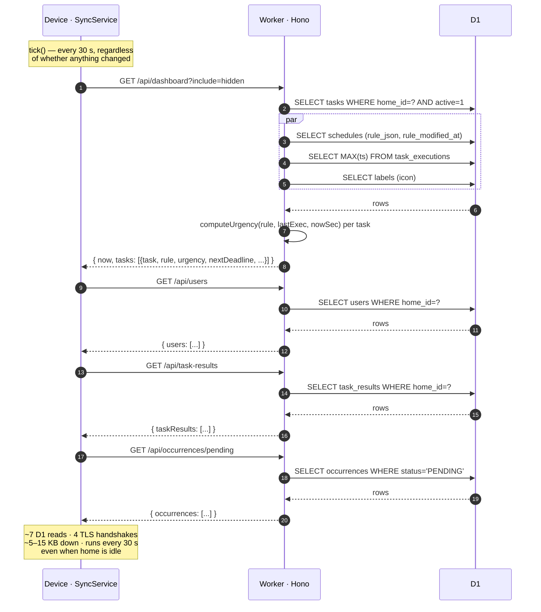
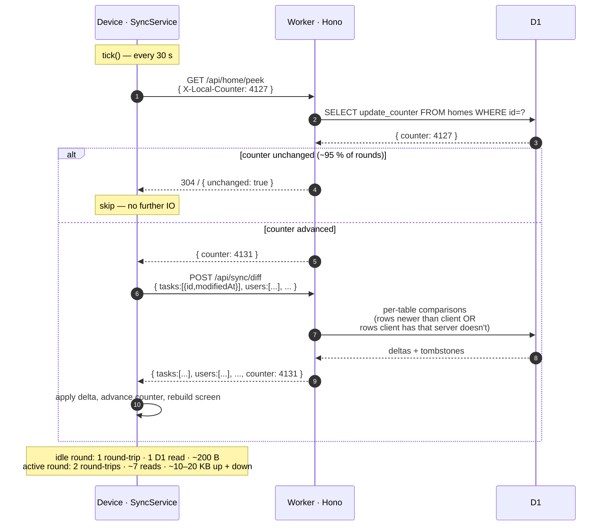
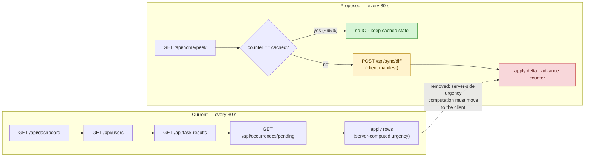

# Sync — current vs. proposed peek-and-diff

> Comparison of the `dev-28`-era sync round against the proposed
> counter-based peek-then-merge optimisation. Verdict: **the peek
> half is a clear win, the diff half is overkill for the sizes we
> have, and the proposal as stated is missing a load-bearing
> piece (server-computed urgency drifts even when no entity
> changes).** Recommendation in §6.

Last updated 2026-05-09 alongside dev-28.

---

## 1. TL;DR

| Metric (per 30 s round, 50-task home) | Current | Proposed (peek + diff) | Notes |
| ------------------------------------- | ------- | ---------------------- | ----- |
| HTTPS round-trips, **idle round** (~95 % of rounds) | **4** | **1** | TLS handshake on ESP32-S3 dominates; this is the headline |
| HTTPS round-trips, **active round** | **4** | **2** | peek + diff |
| D1 reads, idle round | **~7** | **1** | peek = single `SELECT update_counter` |
| D1 reads, active round | **~7** | **~7+manifest** | comparable; diff shape adds a small per-table merge |
| Wire bytes, idle round | **~5–15 KB** | **~200 B** | peek response only |
| Wire bytes, active round | **~5–15 KB** | **~10–20 KB** | manifest upload swells the request side |
| Server-computed urgency | yes (`services/urgency.ts`) | **proposal silent** | ⚠ critical gap — see §5 |
| Mutations to instrument | n/a | **every INSERT/UPDATE/DELETE** in 11 routes | implementation cost |

**Bottom line:** ship the peek, defer the diff, port `urgency.ts`
to firmware, and the device's network footprint drops by an order
of magnitude in the steady state.

---

## 2. Current sync round

`SyncService::runRound()` ([firmware/src/application/SyncService.cpp:29](../firmware/src/application/SyncService.cpp:29))
fires four sequential HTTPS GETs every `intervalMs_ = 30000`. Each
is a fresh `WiFiClientSecure` so each pays a TLS-1.2 handshake
(~500–1000 ms on ESP32-S3 with the current `setInsecure()` config).

### Where the cost lands

- **Device radio + CPU.** Four TLS handshakes dominate the round.
  `setInsecure()` skips cert validation but the ECDHE handshake
  still costs ~600 ms apiece on ESP32-S3 at 240 MHz.
- **Worker CPU.** `services/urgency.ts` runs N times per dashboard
  request, where N = active task count. Cheap individually,
  multiplied across every device every 30 s.
- **D1 reads.** ~7 per round. The Cloudflare D1 free tier caps
  reads at 5 M/day — at 30 s polling per device, one device burns
  ~20 k reads/day on sync alone.
- **Wire bandwidth.** ~5–15 KB JSON per round. Negligible per
  round, real at fleet scale.

### What the current design *does* have right

The dashboard endpoint server-computes urgency. That keeps
`urgency.ts` in one place (the webapp wouldn't want to ship its
own copy) and lets the device render `"in 14m"` labels without
ever knowing the urgency rules.

That property is the load-bearing assumption the proposed peek
breaks. See §5.

---

## 3. Proposed peek-then-merge

Quoting the proposal:

> - Add update counter (integer/long) on Home.
> - Counter is incremented on every DB change (except reads) of
>   any entity belonging to the home.
> - Own changes increment counter and `modifiedAt`.
> - "Peek" sends the device's last-seen counter to the server.
> - Server compares — equal → respond "no sync needed"; not
>   equal → client sends every entity it has, server diffs by
>   `modifiedAt`, server returns merged delta + new counter,
>   client applies.

### Mechanics

- **Counter storage.** New `homes.update_counter INTEGER NOT NULL
  DEFAULT 0`.
- **Triggers.** Easiest correct path is one D1 trigger per
  home-scoped table, fired on `INSERT/UPDATE/DELETE`, that runs
  `UPDATE homes SET update_counter = update_counter + 1 WHERE id =
  NEW.home_id`. Tables to instrument:

  | Table | home_id source | Notes |
  | --- | --- | --- |
  | `users` | direct | |
  | `labels` | direct | |
  | `task_results` | direct | |
  | `tasks` | direct | covers task changes + soft-delete |
  | `task_assignments` | via `tasks.home_id` lookup | join — needs `INSTEAD OF` or a per-route bump |
  | `schedules` | via `tasks.home_id` lookup | same |
  | `task_executions` | direct | hot table — every ack bumps |
  | `occurrences` | via `tasks.home_id` | hot — every cron tick fires |
  | `devices` | direct | |
  | `schedule_templates` | direct (nullable for system) | |
  | `home_avatars` etc. | direct | |

  `pending_pairings`, `auth_logs`, `web_push_subscriptions` —
  intentionally excluded; they don't appear in any sync payload.

- **Counter atomicity.** D1 (`SQLite`) runs each statement
  atomically, so a single `UPDATE … SET counter = counter + 1`
  is race-safe. The trigger compiles to one statement after the
  mutating one — both within the same prepared statement, so a
  second concurrent mutation can't interleave before the trigger
  observes the new row.

- **Migration.** `0011_update_counter.sql` adds the column with
  default 0, creates the eleven triggers, and bumps every existing
  home to `1` so devices that boot post-migration see a
  guaranteed mismatch on first peek. ~80 lines.

---

## 4. Side-by-side, with deltas highlighted

| Axis | Current | Proposed | Change |
| --- | --- | --- | --- |
| Polling cadence | 30 s | 30 s peek + on-demand diff | same shape |
| Idle-round cost | 4× TLS, ~7 D1, ~10 KB | 1× TLS, 1 D1, ~200 B | 🟢 **~10× cheaper** |
| Active-round cost | 4× TLS, ~7 D1, ~10 KB down | 2× TLS, ~7 D1, ~10 KB up + ~10 KB down | 🟡 **upload swells**, otherwise comparable |
| Mutation hot-path cost | 0 | +1 trigger fire per write | 🟡 negligible (microseconds) but ubiquitous |
| Server urgency compute | every 30 s, every device | only on counter change | 🟢 huge reduction in worker CPU |
| Urgency label freshness | always within 30 s | **stale until counter changes**, see §5 | 🔴 regression unless mitigated |
| Code surface added | 0 | migration + 11 triggers + 2 endpoints + firmware diff merge + (recommended) urgency port | 🔴 substantial |
| Code surface removed | n/a | `services/urgency.ts` invocation from `dashboard.ts` (still used by webapp) | 🟢 small |

---

## 5. The load-bearing caveat — urgency drifts even when nothing changes

The proposal as stated assumes `update_counter` captures
everything the device's view depends on. **It doesn't.** The
dashboard renders four time-derived values per task:

- `urgency` — `URGENT` vs `NON_URGENT` vs `HIDDEN`, transitions
  as `now` crosses `nextDeadline`.
- `nextDeadline` — drifts forward when the user acks an
  occurrence (covered by counter — `task_executions` mutation
  fires the trigger). Also drifts forward when DAILY/PERIODIC
  rules cross midnight or interval boundaries (**not** covered
  — no DB write).
- `secondsUntilNext` — purely a function of `nextDeadline - now`.
  Changes every second, never any DB write.
- `isMissed` — flips when `now > prevDeadline + grace`. Never any
  DB write.

So under the proposal, a device whose home counter hasn't moved
will sit on its cached "in 14m" label for as long as the home
stays idle. Real device, real user, this looks like the screen
is broken.

**Two fixes:**

1. **Periodic dashboard refresh independent of counter** —
   simplest. The peek stays; the device additionally re-fetches
   the dashboard every (say) 5 min regardless of counter, so
   urgency labels never drift more than 5 min stale. Reduces
   savings from "10× fewer rounds" to "10× cheaper for ~89 % of
   rounds, full sync every 5 min." Still a big win.

2. **Port `urgency.ts` to firmware** — proper. Device computes
   urgency, `nextDeadline`, `secondsUntilNext`, `isMissed` locally
   from synced rules + last-execution timestamps + serverNow.
   The dashboard endpoint goes back to being a pure data fetch;
   server-side urgency lives only on the webapp path. ~150 LOC of
   C++ in firmware/src/domain/. Aligns with the Phase 5/MQTT
   plan §10 where adapters become data-only anyway.

Either is fine. (1) ships in a day, (2) ships in a week and is
the architecturally correct end state. Doing (1) first then (2)
later is the same total work in two slices.

---

## 6. Recommendation

**Ship in three slices, gated on each other:**

### Slice A — peek only (≈ 1 day)

- `0011_update_counter.sql`: add `homes.update_counter`, create
  the eleven triggers, backfill to 1.
- `GET /api/home/peek` (~10 LOC): reads the counter, returns
  `{counter}`. Accepts both user + device tokens like
  `/api/dashboard` does.
- Firmware `SyncService` change: cache last-seen counter; tick
  hits peek first; on equality, **return without doing the four
  GETs**; on mismatch, fall through to the existing four-fetch
  path and store the new counter.
- **Plus** a periodic full refresh every 5 min so urgency stays
  fresh (see §5 fix 1).

This alone cuts idle-round cost by ~80 % without any of the
proposal's complex parts. Completes the optimisation that
matters most: stop hammering the worker when nothing's changed.

### Slice B — local urgency (≈ 1 week, after A)

- Port `services/urgency.ts` ⇒ `firmware/src/domain/Urgency.h` +
  matching unit tests in `test_domain/`.
- Dashboard endpoint stops emitting `urgency / nextDeadline /
  secondsUntilNext / isMissed` to device clients (still emits
  them for the webapp via a query flag).
- Drop the periodic 5-min refresh from Slice A — counter is now
  authoritative.

This is what unlocks "30 s peek, full fetch only on real
changes" and brings the system in line with the Phase 5 MQTT
adapter plan.

### Slice C — diff endpoint (defer indefinitely; revisit if profiling shows need)

- Active-round wire bytes: with current home sizes (≤ 50 tasks,
  ≤ 10 users, ≤ 10 result types) the full sync after a counter
  change is ~10 KB. Not worth a custom merge endpoint.
- **Revisit** when a single home crosses ~500 tasks or when
  Phase 6 metering shows mutation-round bandwidth in the top
  three cost lines on Workers Analytics.
- Until then, the simpler "counter advanced ⇒ refetch
  everything" is faster to write, easier to reason about, and
  loses nothing measurable.

---

## 7. Risks + answers

| Risk | Mitigation |
| --- | --- |
| Trigger forgotten on a future table → counter doesn't bump → device misses changes | One CI test that asserts every table with a `home_id` column has a corresponding trigger row in `sqlite_master`. Catches the omission at PR time. |
| Counter overflow | `INTEGER` in SQLite is 64-bit. At 1 M mutations/day across all homes, overflow is ~25 000 000 years out. Ignore. |
| Mutation-heavy hot tables (`task_executions`, `occurrences`) cause counter to advance constantly → device never gets to skip | Counter advancing on every cron tick is fine: the device's view *does* change when an occurrence materialises. If those tables turn out to bump counter even when no device-visible field changed, gate the trigger on the specific columns (`AFTER UPDATE OF status,acked_at`). |
| Concurrent writers race the counter | `UPDATE homes SET counter = counter + 1` is one atomic SQLite statement, safe under D1's serialisable isolation. |
| Webapp doesn't peek — no benefit there | Webapp still uses the four endpoints directly + already has its own React-Query staleness model. Don't migrate the webapp; the peek is a device-side optimisation. |
| Migration deploys racey with running devices | Triggers + column add are idempotent; existing devices boot without a cached counter, so their first peek is a guaranteed mismatch and they fall through to a full fetch. No downtime. |

---

## 8. What I'd not do

- **Don't ship the diff endpoint as proposed.** Uploading the
  client's full manifest before every active round trades a
  small download saving for a real upload tax, plus a sizeable
  new endpoint to keep correct across every entity table. The
  numbers don't justify it at our scale.
- **Don't make `update_counter` part of every entity.** The
  proposal puts it on `Home` — keep it there. A counter per
  entity is what `updated_at` already is; duplicating that
  costs schema space without unlocking anything.
- **Don't use the counter to gate the dashboard urgency
  computation alone.** The four time-derived fields are
  load-bearing for the device UI; either refresh periodically
  or compute locally. Punt to neither and the dial silently
  shows wrong "due in N min" labels — exactly the trust-rot
  the dev-28 cycle was about preventing.
